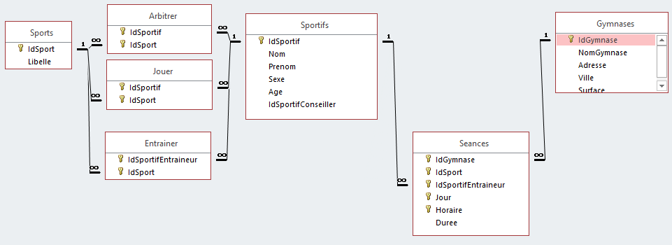

# SAÉ NoSQL - Séance 3

La première séance a permis de se familiariser avec la base de données *ClassicModel*. Durant la deuxième séance nous avons sélectionné la base de données NoSQL ainsi que son architecture cible.

1. Création de requêtes SQL sur la BD initiale ;
2. Réflexion sur le format des données à obtenir et l’algorithme à réaliser ;
3. Écriture du script Python permettant le passage de SQLite à NoSQL ;
4. Création des requêtes initiales au nouveau format NoSQL pour s’assurer que la migration s’est bien passée.

L'objectif de cette séance est d'écrire le script de migration d'une base de données vers un modèle MongoDB (points 3 et 4).

## Données

Pour la suite du TP nous utiliserons les données `Gymnase2000` disponibles dans le fichier `Gymnase2000.sqlite` dont le schéma est ci-dessous.



À partir de ce schéma nous allons créer deux collections :
- **Gymnases** : chaque document concerne un *gymnase*, dans lequel on ajoute les informations de toutes les *séances* prévues (sous la forme d'une liste)
- **Sportifs** : chaque document concerne un *sportif*, dans lequel on notera les sports qu'il *joue*, ainsi que saon entraîneur.e et les arbitres.

### Création de la collection Gymnases

On commence par se connecter à la base de données en local.

```python
import sqlite3
import pandas
import pymongo

client = pymongo.MongoClient()
db = client.sae

# Création de la connexion
conn = sqlite3.connect("Gymnase2000.sqlite")
```

Une fois ceci fait, nous pouvons récupérer les données en faisant des requêtes SQL, comme suit.

```python
gymnases = pandas.read_sql_query(
    """
    SELECT *
    FROM Gymnases;
    """,
    conn
)

seances = pandas.read_sql_query(
    """
    SELECT *
    FROM Seances
    INNER JOIN Sports
    USING (IdSport);
    """,
    conn
)
```

Maintenant, il faut ajouter une colonne `seances` dans `gymnases`. Pour cela, regardons le résultat attendu pour le gymnase ayant l'identifiant `6`.

```python
id = 6
gym6 = seances.query('IdGymnase == @id')
print(gym6)
```

Le résultat est le suivant :

| IdGymnase | IdSport | IdSportifEntraineur | Jour     | Horaire | Durée | Libelle |
|-----------|---------|---------------------|----------|---------|-------|---------|
| 6         | 5       | 6                   | vendredi | 19.0    | 60    | Hockey  |
| 6         | 5       | 7                   | jeudi    | 17.0    | 90    | Hockey  |

On voit ici qu'il y a les identifiants du gymnase et du sport qui sont des informations redondantes car déjà présentes dans l'objet `gymnases`. Pour ce faire, nous allons les supprimer et les convertir en liste afin de les ajouter dans `gymnases` (grâce aux fonctions `drop` et `to_dict`).

```python
seances.query('IdGymnase == @id')
    .drop(columns = ["IdGymnase", "IdSport"])
    .to_dict(orient = "records")
```

Et on obtient

```
[
    {
        'IdSportifEntraineur': 6,
        'Jour': 'vendredi',
        'Horaire': 19.0,
        'Duree': 60,
        'Libelle': 'Hockey'
    },
    {
        'IdSportifEntraineur': 7,
        'Jour': 'jeudi',
        'Horaire': 17.0,
        'Duree': 90,
        'Libelle': 'Hockey'
    }
]
```

On peut faire cette opération au travers d'une liste compréhension pour toutes les séances :

```python
sessions = [
    seances.query('IdGymnase == @id')
        .drop(columns=["IdGymnase", "IdSport"])
        .to_dict(orient = "records") 
        for id in gymnases.IdGymnase
]
print(sessions)
```

Il ne reste plus qu'à ajouter ce résultat dans `gymnases`.

```python
gymnases = gymnases.assign(Sessions = sessions)
gymnases.head()
```