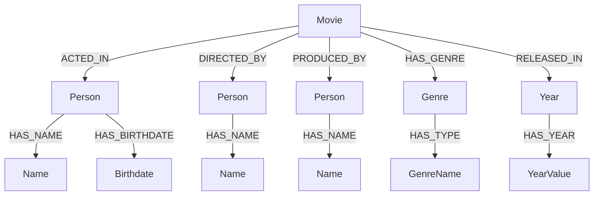

# TP4 - Neo4j

## Objectifs

- Comprendre les bases de la modélisation des graphes dans Neo4j
- Apprendre à utiliser Cypher, le langage de requête de Neo4j
- Requêter une base de données Neo4j pour extraire des informations

## Prérequis

1. **Installation de Neo4j**  
   Si Neo4j n'est pas déjà installé sur votre machine, vous pouvez le télécharger à partir de [ce lien](https://neo4j.com/download/).
   
2. **Démarrage de Neo4j**  
   Une fois installé, démarrez Neo4j. Vous pouvez accéder à Neo4j au travers du logiciel ou bien sur l'interface web via [http://localhost:7474](http://localhost:7474).

3. **Chargement d'une base de données exemple**  
   Pour ce TP, nous allons utiliser une base de données de films. Vous pouvez charger la base avec la commande suivante dans la console Neo4j :
   ```cypher
   :PLAY northwind
   ```

## Introduction à Cypher

Cypher est le langage de requête de Neo4j. Voici quelques exemples de syntaxe de base.

### Création de nœuds

Créez un nœud représentant une personne :
```cypher
CREATE (n:Person {name: 'Alice', age: 30})
```

### Création de relations

Ajoutez une relation entre deux nœuds :
```cypher
MATCH (a:Person {name: 'Alice'}), (b:Person {name: 'Bob'})
CREATE (a)-[:FRIEND]->(b)
```

### Recherche de nœuds

Recherchez tous les nœuds de type `Person` :
```cypher
MATCH (n:Person) RETURN n
```

## Requêtes sur une base de données Northwind

Les requêtes suivantes vous permettront de vous familiariser avec Cypher et d'explorer la base de données *Northwind*. Pour plus d'informations sur la base de données *Northwind*, vous pouvez consulter [ce lien](https://github.com/neo4j-graph-examples/northwind/).

### Lister tous les produits

Pour lister tous les produits présents dans la base de données *Northwind*, utilisez la requête suivante :
```cypher
MATCH (p:Product) RETURN p.productName
```

### Rechercher un produit spécifique

Recherchez un produit spécifique par son nom :
```cypher
MATCH (p:Product {productName: 'Chai'}) RETURN p
```

### Trouver les commandes d'un produit

Pour trouver toutes les commandes qui contiennent un produit donné :
```cypher
MATCH (o:Order)-[:CONTAINS]->(p:Product {productName: 'Chai'})
RETURN o.orderID
```

### Requêter les relations

Pour lister toutes les relations entre les nœuds `Order` et `Product` :
```cypher
MATCH (o:Order)-[r]->(p:Product)
RETURN o.orderID, type(r), p.productName
```

## Requêtes avancées

### Trouver les produits commandés par un client

Pour trouver tous les produits commandés par un client donné :
```cypher
MATCH (c:Customer {customerName: 'Alfreds Futterkiste'})-[:PLACED]->(o:Order)-[:CONTAINS]->(p:Product)
RETURN p.productName
```

### Recommandation de produits

Pour recommander des produits que les autres clients ayant commandé les mêmes produits que *Alfreds Futterkiste* ont également achetés :
```cypher
MATCH (c:Customer {customerName: 'Alfreds Futterkiste'})-[:PLACED]->(o:Order)-[:CONTAINS]->(p:Product)<-[:CONTAINS]-(otherOrder:Order)<-[:PLACED]-(otherCustomer:Customer)-[:PLACED]->(recommendedOrder:Order)-[:CONTAINS]->(recommendedProduct:Product)
WHERE NOT (c)-[:PLACED]->(:Order)-[:CONTAINS]->(recommendedProduct)
RETURN DISTINCT recommendedProduct.productName
```

## Modifications et suppression de données

### Mise à jour d'un nœud

Modifiez un attribut d'un produit existant :
```cypher
MATCH (p:Product {productName: 'Chai'})
SET p.price = 19.99
```

### Suppression d'un produit et ses relations

Supprimez un produit et toutes ses relations avec les commandes :
```cypher
MATCH (p:Product {productName: 'Chai'})
DETACH DELETE p
```

## Exploration des performances

### Utilisation des index

Créez un index pour améliorer les performances des recherches sur les produits :
```cypher
CREATE INDEX FOR (p:Product) ON (p.productName)
```

### Profilage d'une requête

Pour voir comment Neo4j exécute une requête et optimiser les performances :
```cypher
PROFILE MATCH (p:Product {productName: 'Chai'})
RETURN p
```

<!-- 
## Requêtes sur une base de données de films

### Lister tous les films

Pour lister tous les films présents dans la base de données, utilisez la requête suivante :
```cypher
MATCH (m:Movie) RETURN m.title
```

### Rechercher un film spécifique

Recherchez un film spécifique par son titre :
```cypher
MATCH (m:Movie {title: 'The Matrix'}) RETURN m
```

### Trouver les acteurs d'un film

Pour trouver tous les acteurs qui ont joué dans un film donné :
```cypher
MATCH (p:Person)-[:ACTED_IN]->(m:Movie {title: 'The Matrix'})
RETURN p.name
```

### Requêter les relations

Pour lister toutes les relations entre les nœuds `Person` et `Movie` :
```cypher
MATCH (p:Person)-[r]->(m:Movie)
RETURN p.name, type(r), m.title
```

## Requêtes avancées

### Trouver les co-acteurs d'une personne

Pour trouver tous les co-acteurs d'une personne donnée (qui ont joué dans les mêmes films) :
```cypher
MATCH (p:Person {name: 'Keanu Reeves'})-[:ACTED_IN]->(m:Movie)<-[:ACTED_IN]-(coActor:Person)
RETURN coActor.name
```

### Recommandation de films

Pour recommander des films que les co-acteurs de Keanu Reeves ont joué mais que Keanu Reeves n'a pas encore vus :
```cypher
MATCH (p:Person {name: 'Keanu Reeves'})-[:ACTED_IN]->(m:Movie)<-[:ACTED_IN]-(coActor:Person)-[:ACTED_IN]->(recommended:Movie)
WHERE NOT (p)-[:ACTED_IN]->(recommended)
RETURN DISTINCT recommended.title
```

## Modifications et suppression de données

### Mise à jour d'un nœud

Modifiez un attribut d'un nœud existant :
```cypher
MATCH (n:Person {name: 'Alice'})
SET n.age = 31
```

### Suppression d'un nœud et ses relations

Supprimez un nœud et toutes ses relations :
```cypher
MATCH (n:Person {name: 'Alice'})
DETACH DELETE n
```

## Exploration des performances

### Utilisation des index

Créez un index pour améliorer les performances des recherches :
```cypher
CREATE INDEX FOR (n:Person) ON (n.name)
```

### Profilage d'une requête

Pour voir comment Neo4j exécute une requête et optimiser les performances :
```cypher
PROFILE MATCH (p:Person {name: 'Keanu Reeves'})-[:ACTED_IN]->(m:Movie)
RETURN m.title
```
--> 

### Questions

Pour la suite de ce TP nous allons utiliser une base de données de films. Voici le schéma de la base de données :



Pour plus d'informations sur la base de données de films, vous pouvez consulter [ce lien](https://github.com/neo4j-graph-examples/recommendations).

Pour charger la base de données de films, utilisez la commande suivante dans la console Neo4j :

```cypher
:PLAY movies
```

Pour chaque question, écrivez la requête Cypher correspondante.

1. Afficher tous les nœuds de type films.
1. Donnez ensuite tous les titres de films.
1. Limitez la réponse précédente à 3 titres, triés en ordre alphabétique.
1. Listez les films dans lesquels *Kevin Bacon* a joué.
1. Trouvez les nœuds acteurs qui ont joué dans un film avec Tom Cruise.
1. Donnez les nœuds acteurs ayant un lien avec Tom Cruise, quel que soit ce lien et le nombre de liens.
1. Limitez la longueur du lien à 3 arcs.
1. Ajoutez le film Darkstar, et quelques acteurs (voir Imdb ou Wikipedia pour plus de détails).
1. Trouvez les acteurs qui ont joué dans le film *The Matrix*.
1. Recherchez les films sortis en 1999.

