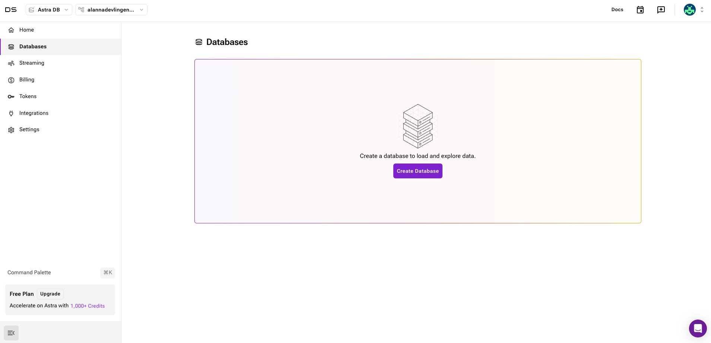
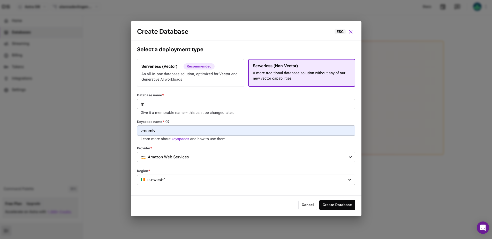
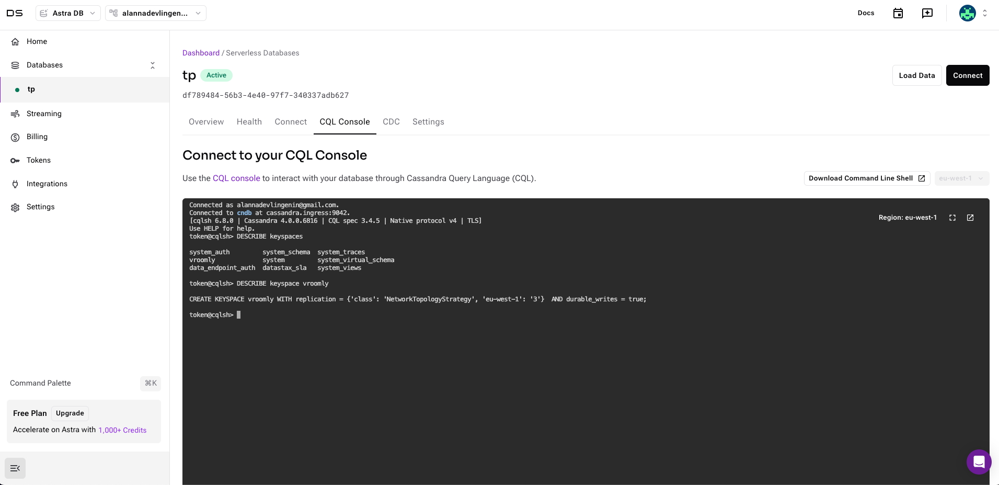
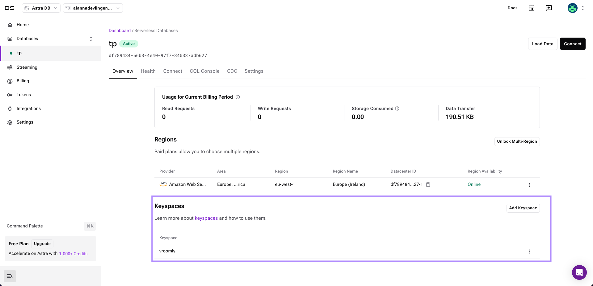
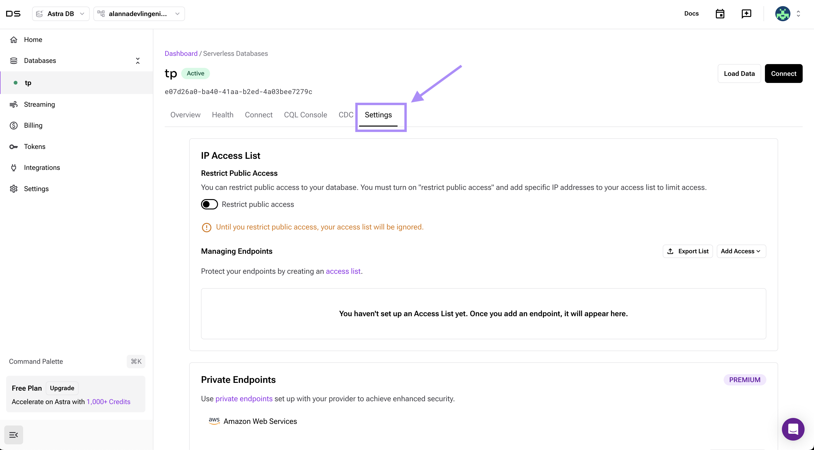
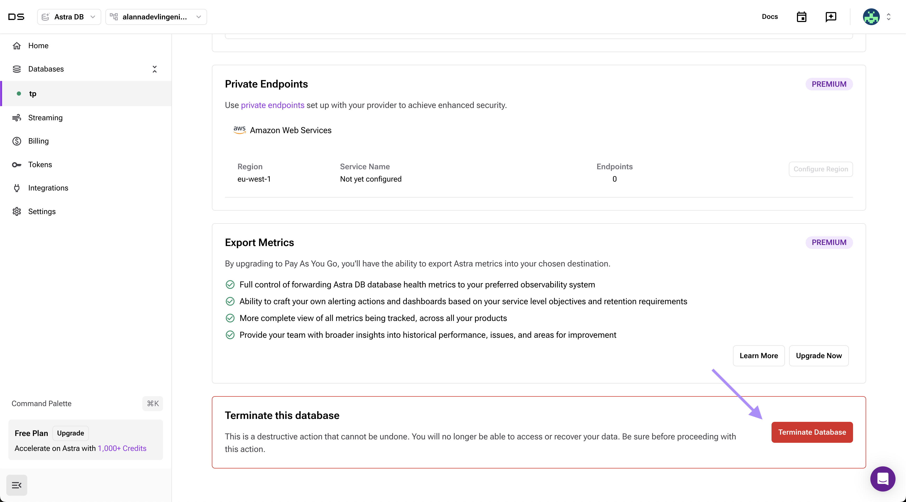

# TP5 - Apache Cassandra

Apache Cassandra est un système de gestion de base de données distribuée open-source conçu pour gérer de grandes quantités de données à travers de nombreux serveurs sans point de défaillance unique. Il est idéal pour les applications nécessitant une haute disponibilité, une scalabilité horizontale et une performance constante.

## Objectif

L'objectif de ce TP est de se familiariser avec la base de données **Apache Cassandra** en réalisant les tâches suivantes :
1. Création d'un keyspace et d'une table ;
2. Insertion de données ;
3. Requêtes de sélection.
4. Suppression de données.
5. Mise à jour de données.
6. Création d'un index.

<!--
Avantages de Cassandra

1. **Scalabilité horizontale** : 
   - Cassandra permet d'ajouter de nouveaux nœuds sans interruption de service. Cette scalabilité horizontale permet de traiter de grandes quantités de données en ajoutant des ressources plutôt qu'en augmentant la puissance des serveurs existants.
   
2. **Haute disponibilité et tolérance aux pannes** : 
   - Les données sont réparties et répliquées sur plusieurs nœuds, ce qui garantit la continuité du service même si un ou plusieurs nœuds tombent en panne.
   
3. **Performance élevée** :
   - Cassandra offre des performances optimisées pour les opérations d'écriture, ce qui en fait une excellente solution pour les applications nécessitant des écritures rapides et fréquentes.
   
4. **Architecture décentralisée** :
   - Il n’y a pas de maître dans un cluster Cassandra, chaque nœud peut traiter les requêtes, ce qui réduit le risque de points de défaillance uniques.

Inconvénients de Cassandra

1. **Complexité de gestion des données** : 
   - Les relations et jointures entre tables ne sont pas supportées, ce qui peut complexifier la gestion de données fortement inter-reliées.
   
2. **Pas de transactions ACID** : 
   - Cassandra n'est pas conforme aux transactions ACID (Atomicité, Cohérence, Isolation, Durabilité), limitant son utilisation pour les applications nécessitant une cohérence stricte.

3. **Langage de requête limité** : 
   - Cassandra utilise CQL (Cassandra Query Language) qui, bien que similaire à SQL, n’offre pas toutes les fonctionnalités relationnelles (jointures, sous-requêtes, etc.).
-->

Avantages de Cassandra
1. Scalabilité horizontale
2. Haute disponibilité et tolérance aux pannes  
3. Performance élevée 
4. Architecture décentralisée

Inconvénients de Cassandra
1. Complexité de gestion des données
2. Pas de transactions ACID
3. Langage de requête limité : les relations et jointures entre tables ne sont pas supportées

## Cas d'utilisation

Cassandra est bien adapté aux applications telles que :
- **Systèmes de messagerie** (réseaux sociaux, plateformes de communication)
- **Analyses en temps réel** (logs, analyse de flux de clics)
- **IoT** (Internet des objets) nécessitant des écritures fréquentes.
## Keyspace

Un keyspace dans Cassandra est un namespace qui regroupe un ensemble de tables (équivalent à un schéma dans une base de données relationnelle). Un keyspace définit les paramètres de réplication pour les données qui y sont stockées.

### Caractéristiques des keyspaces

- **Stratégie de réplication** : La stratégie de réplication définit comment les données sont copiées entre les nœuds. Il existe plusieurs stratégies de réplication, comme `SimpleStrategy` pour une réplication dans un seul data center, et `NetworkTopologyStrategy` pour plusieurs data centers.
- **Facteur de réplication** : Définit le nombre de copies de données dans le cluster. Par exemple, un facteur de réplication de 3 signifie que chaque donnée est répliquée sur trois nœuds.
- **Durée de vie** : Les keyspaces permettent également de définir des durées de vie spécifiques pour les tables, ce qui peut être utile pour les tables de données temporaires.

## Typologie

Il existe différents concepts dans Cassandra qui correspondent à des concepts similaires dans les bases de données relationnelles. Le tableau ci-dessous présente une comparaison entre les termes utilisés dans Cassandra et ceux utilisés dans les bases de données relationnelles.

| Apache Cassandra | Base de données relationnelle |
|------------------|-------------------------------|
| Keyspace         | Base de données               |
| Partition Key    | Index primaire                |
| Cluster Key      | Clé secondaire (index)        |
| Cluster          | Ensemble de serveurs          |
| Réplication      | Réplication/Backup            |

## Place à la pratique

Nous allons créer un [compte DataStax](https://astra.datastax.com/signup) afin de pouvoir héberger une base de données Apache Cassandra.

Une fois votre compte crée, vous allez pouvoir créer une base de données. Pour cela, cliquez sur l'onglet **Databases** puis sur **Create Database**.



Cela vous amènera sur une page où vous pourrez choisir le type de base de données que vous souhaitez créer. Sélectionnez **Serverless (Non-Vector)** puis renseignez le nom de la base de données, le nom du keyspace ainsi que la région (ne pas changer le provider).

- **Nom de la base de données** : `tp`
- **Nom du keyspace** : `vroomly`
- **Région** : `eu-west-1`



La création de la base de données peut prendre quelques minutes. Une fois terminée, vous pourrez accéder à la console CQL.



> [!WARNING]
> Sur DataStax il n'est pas possible de créer/modifier/supprimer un keyspace via les commandes CQL. Pour cela, vous devrez passer par l'interface web.
> 

## Cassandra Query Language

CQL (Cassandra Query Language) est le langage de requête utilisé par Apache Cassandra. Bien qu'il ressemble à SQL, il est conçu pour les opérations de base de données distribuées sans prise en charge de certaines fonctionnalités comme les jointures.

### Exemples de commandes en CQL


Voici quelques exemples de commandes CQL pour interagir avec la base de données `library` qui contient les données des utilisateurs et des emprunts de livres d'une bibliothèque.

- **Création d'un keyspace** :
    ```cql
    CREATE KEYSPACE library
    WITH replication = {'class': 'SimpleStrategy', 'replication_factor': 3};
    ```
  
- **Changement de keyspace** : 
    ```cql
    USE library ;
    ```
    L'instruction `USE` replace le keyspace courant par celui spécifié dans la requête.
    Ainsi, toutes les requêtes suivantes seront exécutées dans le keyspace `library`.
    Il n'est pas nécessaire de spécifier le keyspace dans les requêtes suivantes.
    On peut écrire directement `CREATE TABLE users (...)` sans spécifier le keyspace.

- **Liste des keyspaces** :
    ```cql
    DESCRIBE KEYSPACES;
    ```
    Cette commande permet de lister tous les keyspaces disponibles dans le cluster.

- **Description d'un keyspace** :
    ```cql
    DESCRIBE KEYSPACE library;
    ```
    Cette commande permet de voir les détails du keyspace `library`.

- **Suppression d'un keyspace** :
    ```cql
    DROP KEYSPACE IF EXISTS library;
    ```

- **Création d’une table** :
    - __Clé primaire simple__
    ```cql
    CREATE TABLE library.users (
        id UUID PRIMARY KEY,
        name TEXT,
        age INT
    );
    ```
    Pour plus d'informations sur les types de données supportés par Cassandra, vous pouvez consulter [la documentation](https://cassandra.apache.org/doc/latest/cql/types.html).

    - __Clé primaire composite__
    ```cql
    CREATE TABLE library.load (
        loan_id UUID,
        user_id UUID,
        timestamp TIMESTAMP,
        PRIMARY KEY (loan_id, user_id)
    );
    ```
    Ici nous avons une table qui possède deux colonnes comme clé primaire. Cela signifie que la combinaison de `loan_id` et `user_id` doit être unique.

    - __Clé de clustering__
    ```cql
    CREATE TABLE library.loan (
        loan_id UUID,
        user_id UUID,
        timestamp TIMESTAMP,
        PRIMARY KEY ((loan_id, user_id), timestamp)
    ) WITH CLUSTERING ORDER BY (timestamp DESC);
    ```
    Ici la clé primaire est composée de `driver_id` et `customer_id`, et la clé de clustering est `timestamp`.
    On ajoute `WITH CLUSTERING ORDER BY (timestamp DESC)` pour trier les données par ordre décroissant de `timestamp`.

- **Liste des tables** :
    ```cql
    DESCRIBE TABLES;
    ```
    Cette commande permet de lister toutes les tables du keyspace courant.

- **Description d'une table** :
    ```cql
    DESCRIBE TABLE library.users;
    ```
    Cette commande permet de voir les détails de la table `customers`.

- **Insertion de données** :
    ```cql
    INSERT INTO library.users (id, name, age)
    VALUES (6a6148d1-4a56-4d6a-a610-cdf7b7e3b959, 'Alice', 30);

    INSERT INTO library.users (id, name, age)
    VALUES (uuid(), 'Bob', 23);
    ```

- **Sélection de données** :
    ```cql
    SELECT * FROM library.users WHERE age > 25;
    ```

- **Mise à jour de données** :
    ```cql
    UPDATE library.users SET age = 26 WHERE id = 6a6148d1-4a56-4d6a-a610-cdf7b7e3b959;
    ```

- **Suppression de données** :
    ```cql
    DELETE FROM library.users WHERE id = 6a6148d1-4a56-4d6a-a610-cdf7b7e3b959;
    ```

- **Suppression d'une table** :
    ```cql
    DROP TABLE IF EXISTS library.users;
    ```

- **Création d'un index** :
    ```cql
    CREATE INDEX IF NOT EXISTS name_index ON users.customers (name);
    ```

- **Suppression d'un index** :
    ```cql
    DROP INDEX IF EXISTS name_index;
    ```

Comme vu dans le cours, chaque table doit correspondre à une requête précise. Ainsi, il est important de bien choisir la clé de partition et la clé de clustering pour optimiser les performances de la base de données. Aussi, il peut être nécessaire de dupliquer les données pour répondre à différents types de requêtes.

> [!IMPORTANT]
> Toutes les colonnes qui sont dans la PRIMARY KEY doivent être utilisées dans la clause WHERE de la requête SELECT.
> Par exemple, si la clé primaire est composée de `id` et `name`, la requête SELECT doit contenir ces deux colonnes dans la clause WHERE.

Documentation :
- [Manipulation de données](https://cassandra.apache.org/doc/stable/cassandra/cql/ddl.html) : CREATE, ALTER, DROP (table, keyspace)
- [Requêtes](https://cassandra.apache.org/doc/stable/cassandra/cql/dml.html) : SELECT, INSERT, UPDATE, DELETE


## TO-DO

### Vroomly

Patricia DUBOIS, présidente de l'entreprise de VTC `Vroomly`, dispose de données sur les utilisateurs et les courses effectuées. Elle souhaite stocker ces données dans une base de données Cassandra pour les analyser et améliorer son service.

Sur le repository GitHub, vous trouverez un fichier `init.cql` contenant les commandes CQL. Vous pouvez les copier-coller dans la console CQL.

Requêtez la base de données pour vérifier que les données ont bien été insérées et vous familiariser avec le CQL (filtrer les trajets faits par un utilisateur donné, etc).

### Nestera

La start-up Nestera dispose de données de capteurs IoT provenant de divers appareils connectés (thermostats, prises intelligentes, lumières, etc). L'objectif est de suivre l'utilisation de l'énergie en temps réel et de fournir aux propriétaires des informations sur leurs habitudes de consommation d'énergie.

Dans ce système, chaque maison dispose de plusieurs appareils IoT qui signalent leur consommation d'énergie toutes les minutes. Nous avons besoin de stocker :
- Les données de consommation d'énergie des différents appareils.
- Les métadonnées des appareils (comme l'emplacement et le type).
- La consommation agrégée pour les rapports et les analyses.

1. Créez un keyspace `nestera`.

2. Créez une table `devices` pour stocker les métadonnées des appareils IoT. La table doit contenir les colonnes suivantes :
   - `device_id` : UUID, clé primaire
   - `home_id` UUID
   - `device_name` TEXT
   - `device_type` TEXT
   - `location` TEXT
<!--
CREATE TABLE IF NOT EXISTS nestera.devices (
    device_id UUID PRIMARY KEY,
    home_id UUID,
    device_name TEXT,
    device_type TEXT,
    location TEXT
);
-->

3. Insérez les données ci-dessous dans la table `devices`.

| device_id                            | device_name            | device_type | home_id                              | location     |
|--------------------------------------|------------------------|-------------|--------------------------------------|--------------|
| c1045906-857f-401f-b16e-425f077ad934 | Kitchen Smart Plug     | smart_plug  | 4e138e7f-2598-4e2d-bba4-cceb190e3737 | kitchen      |
| f0c107b2-82e3-4ed3-97ac-0ceeaaac8196 | Living Room Thermostat | thermostat  | f3e35e3f-a2bf-4b53-838d-7370065fb222 | living room  |

<!--
INSERT INTO nestera.devices (device_id, home_id, device_name, device_type, location)
VALUES (uuid(), uuid(), 'Living Room Thermostat', 'thermostat', 'living room');

INSERT INTO nestera.devices (device_id, home_id, device_name, device_type, location)
VALUES (uuid(), uuid(), 'Kitchen Smart Plug', 'smart_plug', 'kitchen');
-->

4. Créez une table `energy_consumption` pour stocker les données de consommation d'énergie avec les colonnes suivantes :
   - `device_id` : UUID, clé primaire
   - `home_id` UUID, clé primaire
   - `timestamp` : TIMESTAMP, clé de clustering
   - `power_usage` : FLOAT
<!--
CREATE TABLE IF NOT EXISTS nestera.energy_consumption (
    device_id UUID,
    home_id UUID,
    timestamp TIMESTAMP,
    power_usage FLOAT,
    PRIMARY KEY ((home_id, device_id), timestamp)
) WITH CLUSTERING ORDER BY (timestamp DESC);
-->
5. Insérez les données suivantes dans la table `energy_consumption`.

| home_id                              | device_id                            | timestamp           | power_usage |
|--------------------------------------|--------------------------------------|---------------------|-------------|
| 4e138e7f-2598-4e2d-bba4-cceb190e3737 | c1045906-857f-401f-b16e-425f077ad934 | 2023-10-07 12:02:19 | 5.5         |
| f3e35e3f-a2bf-4b53-838d-7370065fb222 | f0c107b2-82e3-4ed3-97ac-0ceeaaac8196 | 2024-11-02 22:01:26 | 3.2         |

> [!TIP]
> Vous pouvez utiliser la fonction `toTimestamp(now())` pour insérer la date actuelle.

<!--
INSERT INTO nestera.energy_consumption (device_id, home_id, timestamp, power_usage)
VALUES (c1045906-857f-401f-b16e-425f077ad934, 4e138e7f-2598-4e2d-bba4-cceb190e3737, toTimestamp(now()), 5.5);

INSERT INTO nestera.energy_consumption (device_id, home_id, timestamp, power_usage)
VALUES (f0c107b2-82e3-4ed3-97ac-0ceeaaac8196, f3e35e3f-a2bf-4b53-838d-7370065fb222, toTimestamp(now()), 3.2);
-->

6. Quel est le résultat de la requête suivante ?
```cql
SELECT * FROM nestera.energy_consumption WHERE home_id=4e138e7f-2598-4e2d-bba4-cceb190e3737;
```
Est-elle valide ? Si non, que faire pour corriger cette requête ?

<!--
Il manque la clé primaire device_id dans la clause WHERE. La requête doit être modifiée comme suit :
```cql
SELECT * FROM energy_consumption WHERE home_id=4e138e7f-2598-4e2d-bba4-cceb190e3737 AND device_id=c1045906-857f-401f-b16e-425f077ad934;
```
-->

7. Créez un index sur la colonne `power_usage` de la table `energy_consumption`.
<!--
```cql
CREATE INDEX IF NOT EXISTS power_usage_index ON nestera.energy_consumption (power_usage);
```
-->

8. Supprimez les données de consommation d'énergie pour l'appareil `c1045906-857f-401f-b16e-425f077ad934`.
<!--
```cql
DELETE FROM nestera.energy_consumption WHERE device_id=c1045906-857f-401f-b16e-425f077ad934 AND home_id=4e138e7f-2598-4e2d-bba4-cceb190e3737;
```
-->

9. Changer le nom de l'appareil `Kitchen Smart Plug` en `Super Smart Plug`.
<!--
```cql
UPDATE nestera.devices SET device_name='Super Smart Plug' WHERE device_id=c1045906-857f-401f-b16e-425f077ad934;
```
-->

10. Créer une table `daily_energy_consumption` pour stocker la consommation d'énergie agrégée par jour pour chaque maison. La table doit contenir les colonnes suivantes :
    - `home_id` : UUID, clé primaire
    - `date` : DATE, clé primaire
    - `total_power_usage` : FLOAT
<!--
```cql
CREATE TABLE IF NOT EXISTS nestera.daily_energy_consumption (
    home_id UUID,
    date DATE,
    total_power_usage FLOAT,
    PRIMARY KEY (home_id, date)
);

CREATE TABLE IF NOT EXISTS nestera.daily_energy_consumption (
    home_id UUID,
    timestamp TIMESTAMP,
    total_power_usage FLOAT,
    PRIMARY KEY (home_id, timestamp)
);


```
-->

11. Insérer dans la table `daily_energy_consumption` les données du fichier `daily_energy_consumption.cql`.

12. Requêtez la base de données pour obtenir la consommation d'énergie agrégée par jour pour le logement `9a1c44b1-32b3-4747-94c1-b024ef4075e2`.
<!--
```cql
SELECT * 
FROM nestera.daily_energy_consumption
WHERE home_id=9a1c44b1-32b3-4747-94c1-b024ef4075e2
ORDER BY timestamp ;

SELECT home_id, avg(total_power_usage) 
FROM nestera.daily_energy_consumption
WHERE home_id=9a1c44b1-32b3-4747-94c1-b024ef4075e2
GROUP BY timestamp;

SELECT home_id, AVG(total_power_usage) 
FROM nestera.daily_energy_consumption
WHERE home_id = 9a1c44b1-32b3-4747-94c1-b024ef4075e2;
GROUP BY timestamp;


SELECT home_id, AVG(total_power_usage) 
FROM nestera.daily_energy_consumption
GROUP BY timestamp;
```
-->

> [!WARNING]
> Une fois le TP terminé, n'oublies pas d'éteindre votre base de données.
> 
> Settings > Terminate Database
> 
> 
> puis
> 