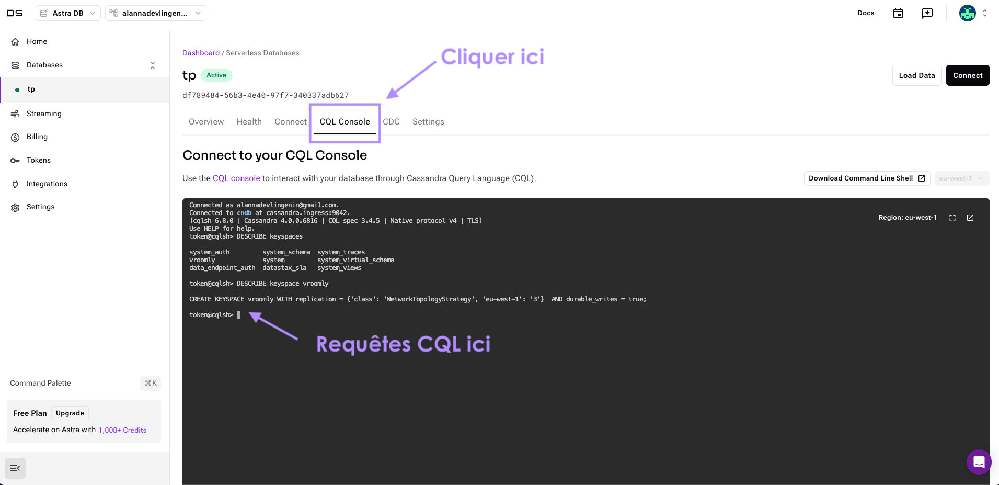

# TP5 - Apache Cassandra

Apache Cassandra est un système de gestion de base de données distribuée open-source conçu pour gérer de grandes quantités de données à travers de nombreux serveurs sans point de défaillance unique. Il est idéal pour les applications nécessitant une haute disponibilité, une scalabilité horizontale et une performance constante.

## Objectif

L'objectif de ce TP est de se familiariser avec la base de données **Apache Cassandra** en réalisant les tâches suivantes :
1. Création d'un keyspace et d'une table ;
2. Insertion de données ;
3. Requêtes de sélection.
4. Suppression de données.
5. Mise à jour de données.
6. Création d'un index.

<!--
Avantages de Cassandra

1. **Scalabilité horizontale** : 
   - Cassandra permet d'ajouter de nouveaux nœuds sans interruption de service. Cette scalabilité horizontale permet de traiter de grandes quantités de données en ajoutant des ressources plutôt qu'en augmentant la puissance des serveurs existants.
   
2. **Haute disponibilité et tolérance aux pannes** : 
   - Les données sont réparties et répliquées sur plusieurs nœuds, ce qui garantit la continuité du service même si un ou plusieurs nœuds tombent en panne.
   
3. **Performance élevée** :
   - Cassandra offre des performances optimisées pour les opérations d'écriture, ce qui en fait une excellente solution pour les applications nécessitant des écritures rapides et fréquentes.
   
4. **Architecture décentralisée** :
   - Il n’y a pas de maître dans un cluster Cassandra, chaque nœud peut traiter les requêtes, ce qui réduit le risque de points de défaillance uniques.

Inconvénients de Cassandra

1. **Complexité de gestion des données** : 
   - Les relations et jointures entre tables ne sont pas supportées, ce qui peut complexifier la gestion de données fortement inter-reliées.
   
2. **Pas de transactions ACID** : 
   - Cassandra n'est pas conforme aux transactions ACID (Atomicité, Cohérence, Isolation, Durabilité), limitant son utilisation pour les applications nécessitant une cohérence stricte.

3. **Langage de requête limité** : 
   - Cassandra utilise CQL (Cassandra Query Language) qui, bien que similaire à SQL, n’offre pas toutes les fonctionnalités relationnelles (jointures, sous-requêtes, etc.).
-->

Avantages de Cassandra
1. Scalabilité horizontale
2. Haute disponibilité et tolérance aux pannes  
3. Performance élevée 
4. Architecture décentralisée

Inconvénients de Cassandra
1. Complexité de gestion des données
2. Pas de transactions ACID
3. Langage de requête limité : les relations et jointures entre tables ne sont pas supportées

## Cas d'utilisation

Cassandra est bien adapté aux applications telles que :
- **Systèmes de messagerie** (réseaux sociaux, plateformes de communication)
- **Analyses en temps réel** (logs, analyse de flux de clics)
- **IoT** (Internet des objets) nécessitant des écritures fréquentes.
## Keyspace

Un keyspace dans Cassandra est un namespace qui regroupe un ensemble de tables (équivalent à un schéma dans une base de données relationnelle). Un keyspace définit les paramètres de réplication pour les données qui y sont stockées.

### Caractéristiques des Keyspaces

- **Stratégie de réplication** : La stratégie de réplication définit comment les données sont copiées entre les nœuds. Il existe plusieurs stratégies de réplication, comme `SimpleStrategy` pour une réplication dans un seul data center, et `NetworkTopologyStrategy` pour plusieurs data centers.
- **Facteur de réplication** : Définit le nombre de copies de données dans le cluster. Par exemple, un facteur de réplication de 3 signifie que chaque donnée est répliquée sur trois nœuds.
- **Durée de vie** : Les keyspaces permettent également de définir des durées de vie spécifiques pour les tables, ce qui peut être utile pour les tables de données temporaires.

## Typologie

Il existe différents concepts dans Cassandra qui correspondent à des concepts similaires dans les bases de données relationnelles. Le tableau ci-dessous présente une comparaison entre les termes utilisés dans Cassandra et ceux utilisés dans les bases de données relationnelles.

| Apache Cassandra | Base de données relationnelle |
|------------------|-------------------------------|
| Keyspace         | Base de données               |
| Partition Key    | Index primaire                |
| Cluster Key      | Clé secondaire (index)        |
| Cluster          | Ensemble de serveurs          |
| Réplication      | Réplication/Backup            |

## CQL - Cassandra Query Language

CQL (Cassandra Query Language) est le langage de requête utilisé par Apache Cassandra. Bien qu'il ressemble à SQL, il est conçu pour les opérations de base de données distribuées sans prise en charge de certaines fonctionnalités comme les jointures.

### Exemples de commandes en CQL

La présidente d'une entreprise de VTC `Vroomly` a une base de données contenant des informations sur les utilisateurs. Voici quelques exemples de commandes CQL pour interagir avec cette base de données :

- **Création d'un keyspace** :
    ```cql
    CREATE KEYSPACE vroomly
    WITH replication = {'class': 'SimpleStrategy', 'replication_factor': 3};
    ```

- **Création d’une table** :
    ```cql
    CREATE TABLE users (
        id UUID PRIMARY KEY,
        name TEXT,
        age INT
    );
    ```
  Pour plus d'informations sur les types de données supportés par Cassandra, vous pouvez consulter [ce lien](https://cassandra.apache.org/doc/latest/cql/types.html).
- **Insertion de données** :
    ```cql
    INSERT INTO users (id, name, age) 
    VALUES (uuid(), 'Alice', 30);
    ```

- **Sélection de données** :
    ```cql
    SELECT * FROM users WHERE age > 25;
    ```
Jusqu'ici cela ressemble à du SQL, mais il y a des différences. En effet, comme vu dans le cours, chaque table correspond à une requête. Ainsi, il est important de bien choisir la clé de partition et la clé de clustering pour optimiser les performances de la base de données.

> [!IMPORTANT]
> Toutes les colonnes qui sont dans la PRIMARY KEY doivent être utilisées dans la clause WHERE de la requête SELECT.
> Par exemple, si la clé primaire est composée de `id` et `name`, la requête SELECT doit contenir ces deux colonnes dans la clause WHERE.

## Place à la pratique

Nous allons créer un [compte DataStax](https://astra.datastax.com/signup) afin de pouvoir héberger une base de données Apache Cassandra.

Une fois votre compte crée, vous allez pouvoir créer une base de données. Pour cela, cliquez sur l'onglet **Databases** puis sur **Create Database**.


Cela vous amènera sur une page où vous pourrez choisir le type de base de données que vous souhaitez créer. Sélectionnez **Serverless (Non-Vector)** puis renseignez le nom de la base de données, le nom du keyspace ainsi que la région (ne pas changer le provider).

- **Nom de la base de données** : `tp`
- **Nom du keyspace** : `vroomly`
- **Région** : `eu-west-1`


La création de la base de données peut prendre quelques minutes. Une fois terminée, vous pourrez accéder à la console CQL.



Vous pouvez maintenant commencer à interagir avec la base de données en utilisant le langage CQL.

Sur le repository GitHub, vous trouverez un fichier `init.cql` contenant les commandes CQL. Vous pouvez les copier-coller dans la console CQL. Requêtez la base de données pour vérifier que les données ont bien été insérées et vous familiariser avec le CQL.

> [!WARNING]
> Sur DataStax il n'est pas possible de créer/modifier/supprimer un keyspace via les commandes CQL. Pour cela, vous devrez passer par l'interface web.

